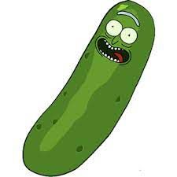
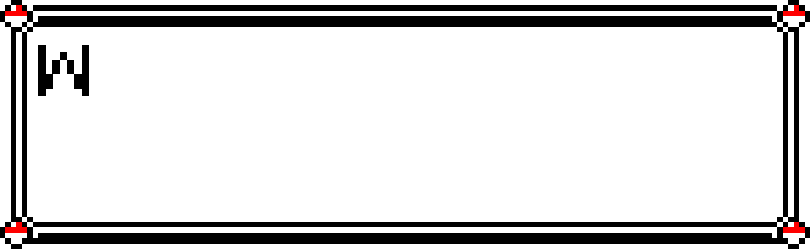

# Pokedialog


```bash
go run cmd/pokedialog/main.go --duration 10 --output welcome.gif --text 'Welcome!!
     This project helps you to build pokedialogs!
     Just follow the instructions below'
```

## Usage

```sh
  -duration float
        duration for the gif in seconds
  -endParagraphDuration float
        end paragraph duration in seconds
  -frames int
        number of frames
  -output string
        file output (default "pokedialog.gif")
  -text string
        text to be render (default "hello world")
```

## Why?



